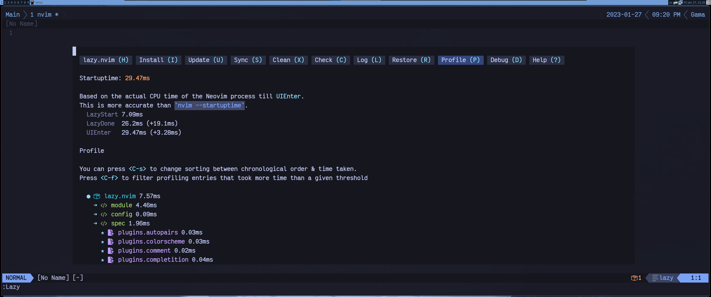

# Configuracion Para Neovim

Esta es mi configuracion para neovim.
La uso todos los dias, puede ser visto en mis videos de [youtube](https://youtube.com/@Alpha_Dev) y directos en [twtich](https://twitch.tv/theAlphaDeveloper)

El objetivo de mi configuracion es ayudarme en mi trabajo cotidiano convirtiendo neovim en la mejor herramienta para poder programar.

## Neovim
Utilizo siempre la ultima version de Neovim, hago el build desde el source code una vez por semana (quizas aveces mas si estoy aburrido jaja).



## Opciones, Autocomandos y Keymaps

Opciones relacionadas al editor se encuentran en `./lua/config/options.lua`
Configuraciones relacionadas a keymaps relacionadas al editor y no a plugins se encuentran en `./lua/config/keymaps.lua`
Autocomandos que quiero registrar se encuentran en `./lua/config/autocmds.lua`
En el mismo directorio se encuentra la configuracion para "Diagnostic" donde configuro los iconos a mostrar para los errores que pueden ser por LSP u otras herramientas, dado que neovim lo maneja como un modulo aparte me gusta tenerlo por serparado.

Todas estas configuraciones las cargo con el evento `VeryLazy` utilizando un autocomando.

## Plugins
Para plugin manager utilizo [lazy](https://github.com/folke/lazy.nvim) el setup del plugin se encuentra en `./lua/config/lazy.lua`
Utilizo la funcionalidad de lazy donde se puede especificar un directorio `./lua/plugins/` como fuente para las especificaciones de los plugins.
Trato de configurar un plugin por archivo, llamando a este archivo como el plugin o como la funcionalidad que realiza.
Nota tambien tengo el archivo `./lua/plugins/init.lua` donde tengo los que no separe, o no me parece suficiente logica para separarlos en su propio archivo de una linea.

### Configuraciones
Para configurar los plugins utilizo la opcion de lazy `config` donde se puede definir de las siguientes formas.
Utilizando la opcion `opts` no es necesario utilizar el `config` dado que lazy va a ver la opcion y automaticamente hacer el `require("plugin").setup(opts)` con las opcioens definidas
Utilizando el valor `true` para `config` donde le indica que tiene que hacer el `require("plugin").setup()` pero sin opciones.
Utilizando una funcion como valor para `config` donde directamente configuro lo necesario ahi.
Utilizando una funcion como valor para `config` donde llamo a otro archivo como `./lua/alpha/lsp` donde la configuracion es extensa y entonces no quiero tenerla toda ahi.

### LazyLoading
Dado que utilizamos el package manager llamado lazy no podia dejar de hablar de esto que es una de sus configuraciones mas importantes, como configurar los plugins para que se carguen solo cuando son necesarios.
Es normal que plugins son solamente requeridos para algunos momentos, entonces no tiene sentido hacerlos cargar al inicio cuando no sabemos siquiera si van a ser ejecutados.
Como ejemplo voy a utilizar `./lua/plugins/database.lua` que es el cual me permite realizar consultas a bases de datos desde dentro de neovim [video](https://youtu.be/su7lWYjnM44).
Este cumple con lo antes mencionado que no quiero que se cargue cuando inicia neovim.
```lua
return {
    "kristijanhusak/vim-dadbod-ui",
    dependencies = {
        "tpope/vim-dadbod",
        "kristijanhusak/vim-dadbod-completion",
        "tpope/vim-dotenv",
    },
    keys = {{"<leader><leader>db", ':tab DBUI<cr>'}},
    init = function ()
        require("alpha.database")
    end
}
```
Para poder realizar eso utilizo la propiedad `keys` la cual cumple una doble funcion.
- le indica a lazy que el plugin solo debe cargarse cuando se apreta esa combinacion de teclas.
- Si tiene un segundo argumento la definicion la toma como el valor o funcion con la cual configurar el keymap, lo cual permite tener un solo lugar donde definir los keymas para el plugin y que lazy sepa cuales son.

Otra manera para hacer el lazyloading es con la opcion `cmd` la cual funciona similar a la de `keys` pero solo que recibe los comandos con los cual va a triggerear la carga del plugin y luego la ejecucion.

Definiendo especificamente `lazy = true`, la cual le dice a lazy que no la incluya directamente solo cuando otro plugin lo llame, util para configurar librerias

La ultima es definiendo por eventos. Los eventos son señales que neovim envia y que en este caso vamos a estar utilizando para triggerear la carga del plugin. En mi configuracion el que utilizo es `VeryLazy` que es un evento de Lazy que indica que ya se cargo neovim y el usuario gano control. Entonces en ese momento se dispara la carga de otros plugins por detras.
Lo utilizo en mis configuraciones como telescope, lsp, dressing, snippets y completition.

## Colorscheme y fuentes
Para colorschem uso [Tokyo Night](https://github.com/folke/tokyonight.nvim)
Como fuente utilizo [Victor Mono](https://rubjo.github.io/victor-mono)
Utilizo el mismo theme para mi terminal Kitty, y la configuracion de la fuente esta en kitty
Para symbolos utilizo como complemento los symbolos de [NerdFonts](https://www.nerdfonts.com/)

## LSP soportando lenguajes
Neovim implementa un cliente de LSP (language server protocol). Esto nos permite una mayor interaccion con distintos lenguajes sin requerir distintos plugins para cada lenaguaje individual.
Neovim en si no sabe nada de los lenguajes que le digamos, neovim simplemente sabe como actuar como cliente, esta en nosotros intalar el servidor correspondiente al lenguaje correspondiente y decirle a neovim como queremos interactuar.
Mi configuración esta separada en las siguientes partes

- `./lua/plugins/lsp.lua`: Aca es donde tengo definidos los paquetes que utilizo relacionado a lsp
- `./lua/alpha/lsp`: en este directorio esta mi configuracion en relacion a esto
- `./lua/alpha/lsp/init.lua`: es el primer archivo en cargar. en este configuro mason quien se va a encargar de instalarlos servidores de lsp necesarios.
Luego aplico la configuracion particular para cada server.
Idealmente este archivo no necesesita ser modificado.
- `./lua/alpha/lsp/attach.lua`: este ya es un archivo más interesante, en donde configuro los mappings relacionados a lsp
estos solamente van a registrarse para buffers que tengan asociado un servidor de lsp.
Aca se pueden cambiar los keybindings o registrar nuevas funciones
- `./lua/alpha/lsp/servers.lua`: acá llegamos al más importante donde registramos los servidores con los mismos nombres que *lspconfig* [ref](https://github.com/neovim/nvim-lspconfig/blob/master/doc/server_configurations.md). En este archivo tenemos una lista que la clave es el nombre del server y como valor es la funcion de registro, para la mayoria podemos utilizar el default, pero algunos servidores tienen una configuracion adicional para esto se puede registrar un callback que debera devolver una tabla con los parametros necesarios.


## Completition
Como motor de completition utilizo `nvim/cmp`. este provee todas las funcionalidas que necesito.
la configuration se puede encontrar en `./lua/alpha/completition/init.lua` donde defino los keymaps y se configura la integracion con las distintas fuentes como lsp, path, luasnip y otros plugins.

## Snippets
Para snippets utilizo *LuaSnip*, el cual la configuración la mantengo en `./lua/plugins/snippets.lua`.
Pero en este archivo no mantengo los snippets en si mismos, en este solamente tengo la configuracion de como interactua, los snippets se encuentran en `./lua/alpha/snips/ft/` cual carpeta contiene un archivo por cada file type y se registran automaticamente cuando agrego un nuevo archivo (recargar con `<leader><leader>s`, o reiniciar neovim).
